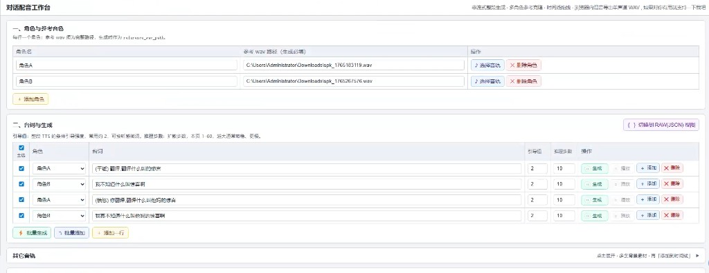
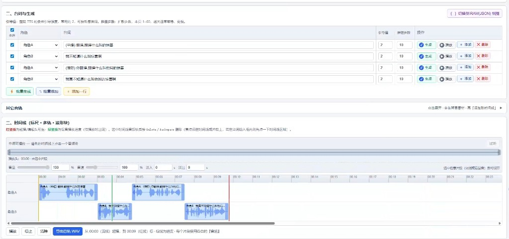

# VoxCPM2 对话配音工作台

> 一体化本地服务：打开网页即可完成角色管理、台词生成、时间线编排、试听和导出，无需再拆分多进程。

---

---

## 这个工具能做什么

- **角色管理**：维护多个角色与参考音频（本地 wav），每句台词可独立绑定角色。  
- **台词批量生成**：支持逐句生成，也支持批量生成，参数可按句微调。  
- **时间线编排**：可视化拖动/拼接片段，快速调整句子先后、间隔和节奏。  
- **背景音混合**：导入背景音后与人声统一试听，适合做完整对话演示。  
- **本地文件友好**：可按文件名自动解析本机路径，减少手工复制路径。  
- **缓存加速**：命中后秒回，重复调试同一台词时非常省时间。  
- **导出结果**：可导出整段 wav，便于后续剪辑、封装或直接投放。  

---


## 典型使用流程

1. 添加角色，给每个角色绑定参考音色 wav。  
2. 在台词区录入对白，选择角色并调整 `cfg` / `steps`。  
3. 先单句试听，再批量生成。  
4. 在时间线里微调节奏与叠放关系。  
5. 合成并导出最终音频。  

---

## 功能截图


### 功能演示截图





---

## 安装与启动

```powershell
# 1) 下载模型
pip install -U "huggingface_hub[cli]"
hf download openbmb/VoxCPM2 --local-dir ./model

# 2) 安装依赖
pip install -r requirements.txt

# 3) 启动
python server.py

# 4) 浏览器打开
#    http://127.0.0.1:8770/
#    → 自动呈现 static/webui.html
```


## 核心特性说明

### 缓存机制（重点）

- 缓存文件位于 `tts_cache/`。  
- 文件名规则：`md5(角色路径 + 台词 + cfg + 步数).wav`。  
- 同一参考音频路径、同一文本和参数，会直接命中缓存。  
- 更换参考音频路径或参数，会自动重新生成，避免串音。  

### 一体化服务

- `server.py` 同时承担：静态页面托管 + 生成服务 + 文件名解析。  
- 默认地址：`http://127.0.0.1:8770/`。  
- 适合本地创作、演示和小团队内网协作。  


## 常见问题

### 启动后打不开页面

- 确认终端中出现 `VoxCPM2 一体化服务启动`。  
- 用浏览器访问 `http://127.0.0.1:8770/`。  
- 若端口占用，改端口后重启：  

```powershell
$env:VOXCPM_PORT = "9001"
python server.py
```

### Windows 下 NumPy / Torch 报错

可尝试：

```powershell
pip uninstall numpy -y
conda install -y numpy -c conda-forge
```

---

## 如果这个项目对你有帮助

如果这个项目对你有帮助，欢迎支持一下。  
感谢你的认可与鼓励。


