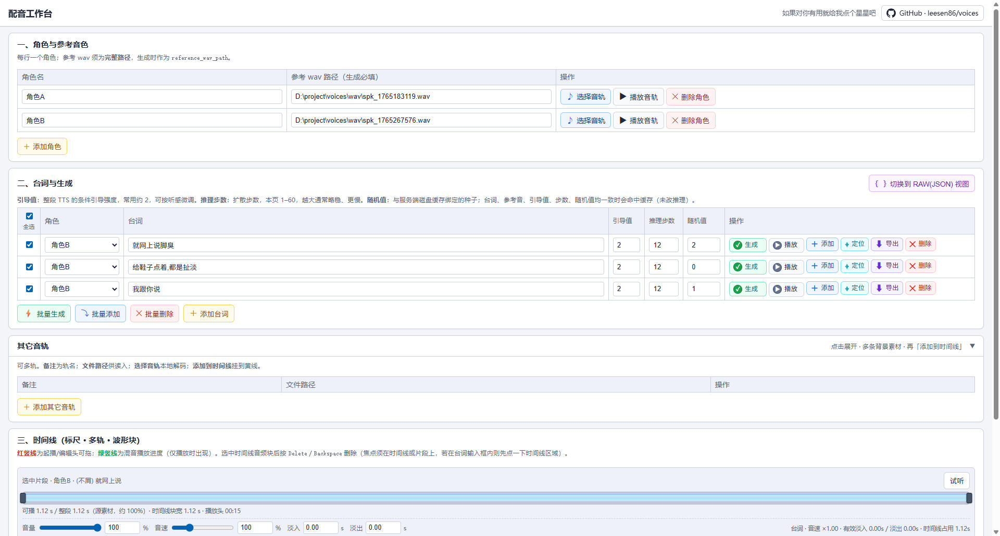
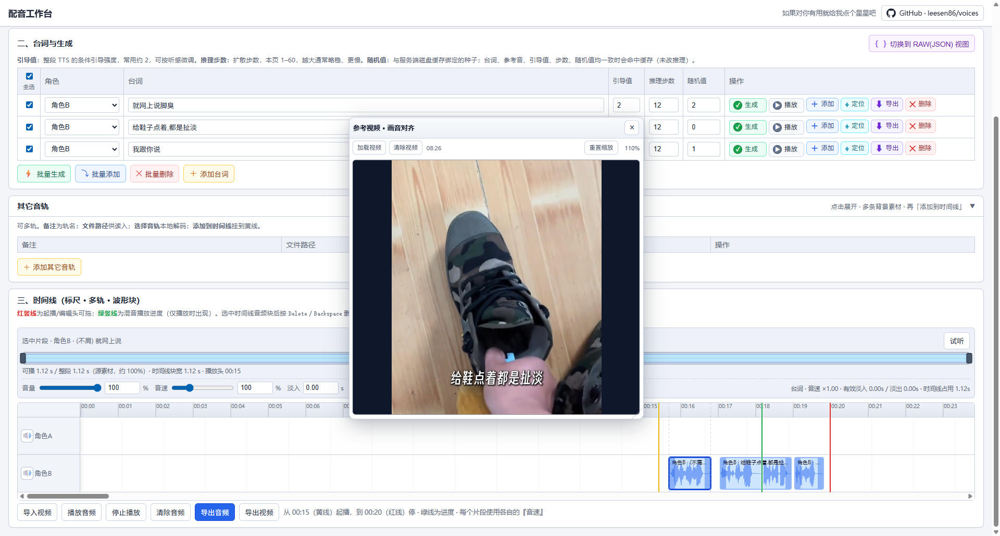

# VoxCPM2 对话配音工作台

> 一体化本地服务：浏览器里完成**多角色参考克隆**、**台词生成**、**多轨时间线**、**试听 / 混音播放**与**导出音频或视频**，默认单进程启动即可。

支持多角色参考克隆 · 时间线拖拽 · 浏览器内混音导出音轨和视频 — 觉得有用欢迎在 GitHub 点个 Star。

[](https://github.com/leesen86/voices)

---

## 这个工具能做什么

### 角色与台词

- **多角色管理**：每个角色绑定本地参考 **wav** 路径（生成时作为参考音色）。  
- **台词表**：逐句编辑；支持 **cfg / 推理步数 / tts_seed** 等按句微调；表头可 **批量勾选**。  
- **生成与试听**：单行「生成」、整表 **批量生成**；生成后可 **试听**、**导出本行 WAV**。  
- **RAW(JSON)**：可将台词区切换为 JSON 编辑后一次写回（适合脚本化或备份）。  
- **批量操作**：批量生成、批量将勾选行 **添加到时间线**、批量删除勾选行（需确认）。  

### 背景音与其它音轨

- **多轨背景素材**：备注 + 文件路径；支持 **选择本地文件** 解码；**添加到时间线** 会挂到当前 **黄线** 位置。  
- 与人声轨一起在时间线上叠加，统一 **混音试听** 与 **导出**。  

### 时间线（多轨波形）

- **角色轨 + 背景轨**：片段可 **拖动** 排序与对齐；选中后可 **Delete / Backspace** 删除（焦点在时间线区域时）。  
- **黄线**：播放头 / 编辑起点；**红线**：播放与 **导出终点**；播放时出现 **绿线** 表示混音进度。  
- **每段可调**：音量百分比、播放速率（音速）、淡入 / 淡出；独立 **波形与顶条裁剪** 与 **试听**（顶条「试听」）。  
- **轨静音**：左侧轨标签旁的扬声器按钮；**静音轨不参与整轨播放与导出**，但仍可对选中片段 **单独试听**。  
- **参考视频（可选）**：浮窗载入本地视频，可与时间轴对齐预览（画音同步用途）。  
- **标尺与轴长**：可缩放像素/秒、设定总时长，或「按片段自动延长」。  

### 导出

- **导出音频**：按当前时间线混音（尊重红线终点与轨静音），导出 **单声道 WAV**（浏览器内合成）。  
- **导出视频**：将参考视频画面与混音结果一并封装（依赖浏览器 **MediaRecorder** 能力，常见为 **MP4** 或 **WebM**）。  

### 其它

- **生成缓存**：相同参考路径 + 台词 + 参数命中 `tts_cache/`，重复调试更快。  
- **路径解析**：服务端可按 **文件名** 在常用目录中搜索音频（减少手工敲长路径）。  
- **纯前端调试**：无需加载模型时，可只起静态页（见下文「运行模式」）。  

---

## 典型使用流程

1. **添加角色**，填写参考 **wav** 完整路径（或通过「选择音轨」载入）。  
2. 在 **台词表** 录入对白，选好角色，按需调整 **cfg / steps / seed**。  
3. **单行生成** 或 **批量生成**；必要时先 **试听** 再统一 **添加到时间线**。  
4. 展开 **其它音轨**，按需添加背景素材并 **添加到时间线**。  
5. 在 **时间线** 上拖动片段、调节音量/速率/淡入淡出，必要时 **静音某轨** 再听整体效果。  
6. 拖动 **黄线 / 红线** 设定导出区间，**导出音频** 或（可选）**导出视频**。  

---

## 功能截图

### 界面示意





---

## 环境要求

- Python 3.10+（推荐），Windows / macOS / Linux。  
- **完整配音功能**需下载 **VoxCPM2** 模型并完成 PyTorch 等依赖安装（见下）。  
- 浏览器建议使用 **Chrome / Edge** 等 Chromium 内核版本，以获得较好的 **Web Audio** 与 **MediaRecorder** 体验。  

---

## 安装与启动

```powershell
# 1) 下载模型（首次）
pip install -U "huggingface_hub[cli]"
hf download openbmb/VoxCPM2 --local-dir ./model

# 2) 安装依赖
pip install -r requirements.txt

# 3) 启动（默认 API + 静态页，端口 8770）
python server.py
```

浏览器访问：**http://127.0.0.1:8770/** ，自动打开 `static/webui.html`。

### 运行模式（可选）

| 命令 | 说明 |
|------|------|
| `python server.py` 或 `python server.py all` | **默认**：推理 API + 静态页面 + 文件名解析。 |
| `python server.py web` | **仅静态前端**（不调 VoxCPM），适合只改 UI / 联调时间线。 |
| `python server.py web 8771` | 同上，监听 **8771**（端口亦可由环境变量指定）。 |
| `python server.py service` | **仅 API**，便于单独调试推理接口。 |

### 端口与环境变量

- **端口**：默认 `8770`。可用 **`VOXCPM_PORT`** 或 **`DUBBING_PORT`**（前者优先）；命令行第二个参数（如 `python server.py web 8771`）会覆盖当前进程端口。  
- **监听地址**：**`VOXCPM_HOST`**，默认 `127.0.0.1`。  
- **额外音频搜索目录**：**`VOXCPM_AUDIO_SEARCH_DIRS`**（Windows 用分号、Unix 用冒号分隔），供按文件名解析路径。  
- **热重载**：**`VOXCPM_RELOAD=1`** 时 uvicorn 热重载（会反复加载模型，开发推理时慎用）。  
- 模型路径、降噪器、缓存目录等仍以 **`api.py` / 服务端说明** 为准（如 **`VOXCPM_MODEL`**、**`VOXCPM_TTS_CACHE_DIR`**）。  

若静态页与 API 不在同源端口，可在页面 URL 增加 **`?api=http://127.0.0.1:8770`**（按实际 API 根地址填写）以指向配音服务。

---

## 核心特性说明

### 缓存机制（重点）

- 缓存目录默认在项目下 **`tts_cache/`**（可通过服务端环境变量调整）。  
- 文件名一般为 **`md5(角色路径 + 台词 + cfg + 步数)`** 等形式（与生成参数一致才命中）。  
- **同一参考路径、台词与参数**会命中缓存；更换参考或文本会自动重新生成，避免串音。  

### 一体化服务在做什么

- **`server.py`**：在同一进程中提供 **静态资源**、**配音相关 HTTP API**，以及 **`/resolve_name`** 等辅助接口。  
- **时间线混音与导出 WAV/视频**：主要在 **浏览器端** 完成（Web Audio / Canvas / MediaRecorder），减轻服务端压力。  

---

## 常见问题

### 启动后打不开页面

- 终端应出现服务启动日志；浏览器访问 **`http://127.0.0.1:8770/`**（若改端口则改用对应端口）。  
- 端口被占用时，可指定其它端口，例如：  

```powershell
$env:VOXCPM_PORT = "9001"
python server.py
```

### Windows 下 NumPy / Torch 报错

可尝试：

```powershell
pip uninstall numpy -y
conda install -y numpy -c conda-forge
```

### 导出视频失败或格式不可用

- 与浏览器是否支持对应 **MediaRecorder** 编码有关，可换 Chromium 系浏览器或查看页面内提示。  
- 导出区间无效时，请确认 **红线在黄线右侧** 且时间线上有可调度的片段。  

---

## 如果这个项目对你有帮助

如果这个项目对你有帮助，欢迎请我喝一杯咖啡。  
感谢你的认可与鼓励。


